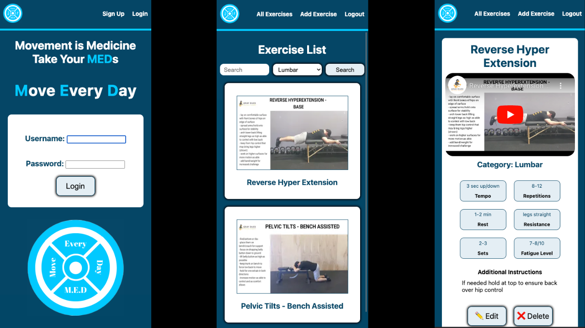

# Move Every Day

Movement is one of the most potent tools for improving mental and physical health. It quite literally **IS** medicine. 

**M**ove **E**very **D**ay is here to help you take your **MED**icine.

**M**ove **E**very **D**ay is based on movements used by Physical Therapists every day in their practice through Home Exercises Programs (HEPs) to help people relieve their pain and get back to full participation in their lives.

Currently, **M**ove **E**very **D**ay is a full-stack Django application utilizing a PostgreSQL database that helps user store exercises, based on youtube videos, to make it easier to find and perform them again and again. Future plans involve creating a program/workout feature that allows for unique collections of these exercises to be created and shared with others. The end goal is to help Doctors of Physical Therapy, personal trainers, or anyone else who wants to help others move better, create and share programs with their patients and clients.

## Click **[HERE](https://njman-move-every-day.fly.dev/)** to use the app

## **Current Features:**
* Users can create an account, log in, and logout
* Users can add exercises
* Users can add a thumbnail photo to an exercise
* Users can edit or delete their exercises
* Users can view all exercises that have been created
* Users can view a single exercise's details
* Youtube videos can be embedded into an exercise
* Users can search for exercises by name
* Users can sort exercises by body part

## **Technologies Used:**

* Django
* Python
* Boto3
* AWS S3
* Docker
* Supabase
* Pyscopg2
* Gunicorn
* Whitenoise
* Django-Environ
* Fly.io
* Git
* GitHub
* JavaScript
* HTML
* CSS

## **Planning Materials:**
User stories that inspired the creation of this app and ERD can be found [Here](https://trello.com/b/RxlLJJZg/move-every-day)

## **Ice Box:**
* [x] Allow users to Use AWS S3 to store images and allow users to upload images as thumbnails 
* [x] Allow users to search for exercises by name
* [x] Allow users to sort exercises by body part
* [ ] Allow users to create programs
* [ ] Allow users to add exercises to programs
* [ ] Allow users to share programs with other users
* [ ] Allow users to view programs shared with them
* [ ] Allow users to edit and delete programs they created
* [ ] Allow users to limit the visibility of an exercise or program to only themselves or to other users